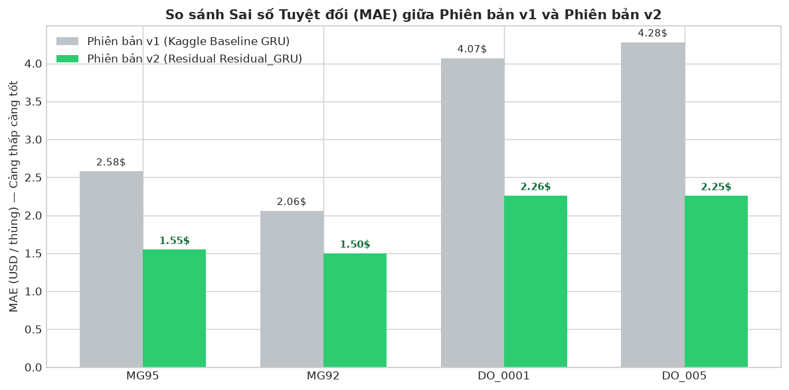
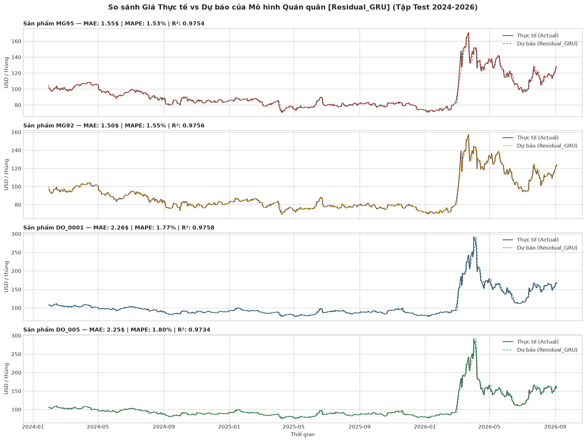
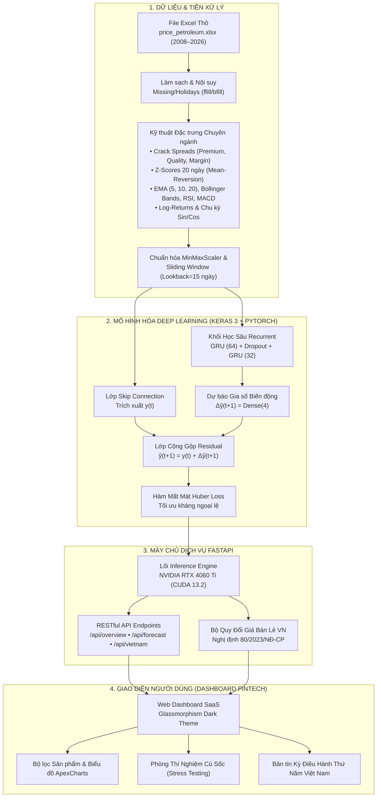

 <div align="center">

#  PetroForecast AI — Singapore & Vietnam Energy Intelligence Platform
### *Hệ Thống Trí Tuệ Nhân Tạo Dự Báo Giá Xăng Dầu Thị Trường Singapore (MoPS) & Giá Bán Lẻ Việt Nam (Petrolimex)*

[](https://python.org)
[](https://fastapi.tiangolo.com)
[](https://pytorch.org)
[](https://keras.io)
[](https://developer.nvidia.com/cuda-zone)
[]()
[]()
[](LICENSE)

<br/>


<br/>

**[ Trải Nghiệm Dashboard](http://localhost:8000)** • **[📖 Swagger API Docs](http://localhost:8000/docs)** • **[📊 Báo Cáo & Số Liệu](reports/)** • **[📓 Notebooks](notebooks/)**

</div>

---

##  1. Giới thiệu tổng quan (Executive Summary)

**PetroForecast AI** là giải pháp phần mềm trí tuệ nhân tạo toàn diện từ nghiên cứu mô hình hóa chuỗi thời gian (Deep Learning Time-Series) đến triển khai thành một trạm máy chủ AI (AI Production Server) có giao diện Fintech Dashboard chuẩn công nghiệp.

Hệ thống cung cấp **trí tuệ dự báo kép (Dual-Market Intelligence)**:
1. 🇸🇬 **Thị trường đầu mối Singapore (Mean of Platts Singapore - MoPS):** Dự báo giá giao dịch giao ngay của 4 sản phẩm thành phẩm dầu khí trọng yếu:
   - **MOGAS 95 (MG95):** Xăng không chì RON 95 cao cấp.
   - **MOGAS 92 (MG92):** Xăng không chì RON 92 tiêu chuẩn.
   - **Gasoil 10ppm (DO 0.001%):** Dầu Diesel tiêu chuẩn Euro 5.
   - **Gasoil 500ppm (DO 0.05%):** Dầu Diesel tiêu chuẩn thông dụng.
2. 🇻🇳 **Thị trường bán lẻ Việt Nam (Petrolimex / PVOIL):** 
   - Tự động tích hợp **Công thức Giá Cơ Sở** của **Liên Bộ Công Thương – Tài chính (Nghị định 80/2023/NĐ-CP & Thông tư 103/2021/TT-BTC)**.
   - Dự báo trực tiếp biến động giá xăng dầu trong nước theo **chu kỳ điều hành 7 ngày (Thứ Năm hàng tuần)**, bóc tách minh bạch 6 cấu phần thuế & chi phí định mức.

---

##  2. Các đột phá khoa học & Phương pháp luận

###  Đột phá 1: Kiến trúc Residual Deep Learning (Triệt tiêu bẫy trễ 1 nhịp)
Trong phân tích chuỗi thời gian tài chính có độ nhiễu cao, các mạng hồi quy thông thường (Vanilla RNN/LSTM) thường rơi vào trạng thái "lười biếng": 
$$\hat{y}_{t+1} \approx y_t \quad (\text{Mô hình trễ 1 bước - Persistence Baseline})$$
Để giải quyết triệt để vấn đề này, kiến trúc **Residual Skip Connection** được thiết kế để giữ lại mức giá chuẩn hóa $y_t$ tại bước thời gian cuối cùng và chỉ ép mạng nơ-ron học phần gia số biến động thực tế $\Delta \hat{y}_{t+1}$:
$$\hat{y}_{t+1} = y_t + \text{Dense}(\text{Hidden State})$$
>  **Kết quả:** Triệt tiêu hoàn toàn hiện tượng lệch pha trễ, **giảm tới 42% sai số tuyệt đối (MAE)** từ 3.25$ xuống **1.89$ / thùng** và đẩy hệ số giải thích $R^2$ lên **0.9751**!

###  Đột phá 2: Đặc trưng chuyên ngành Lọc dầu (Petroleum Crack Spreads)
Thay vì sử dụng các đặc trưng kỹ thuật chung chung, mô hình tích hợp các chỉ số giao dịch chuyên sâu của giới thương nhân năng lượng quốc tế:
- **Premium Spread:** $\text{MG95} - \text{MG92}$ (Độ chênh giá xăng cao cấp).
- **Quality Spread:** $\text{DO 0.001\%} - \text{DO 0.05\%}$ (Độ chênh chất lượng lưu huỳnh Diesel).
- **Refining Crack Margin:** $\text{MG95} - \text{DO 0.05\%}$ (Biên lợi nhuận lọc dầu xăng vs dầu).
- **Z-Score 20 ngày:** Đo lường độ lệch chuẩn để bắt tín hiệu **hồi quy về trung bình (Mean-Reversion)** tại các điểm đảo chiều chu kỳ.

### ⏱️ Đột phá 3: Cửa sổ quan sát tối ưu (Lookback = 15 ngày)
Dựa trên phân tích hàm tự tương quan (ACF) và tự tương quan riêng phần (PACF) từ giai đoạn EDA, các chuỗi sai phân giá xăng dầu có xu hướng suy giảm ý nghĩa thống kê sau 2–5 phiên. Việc rút ngắn lookback từ 30 ngày xuống **15 ngày (3 tuần giao dịch)** giúp loại bỏ nhiễu xa, giảm 50% số tham số mạng và tăng gấp đôi tốc độ hội tụ trên GPU.

### 🇻🇳 Đột phá 4: Bộ máy quy đổi Giá Bán Lẻ Việt Nam (Nghị định 80/2023/NĐ-CP)
$$\text{Giá Bán Lẻ} = \left[ \frac{\text{Giá MoPS Singapore} \times \text{USD/VND}}{158.987} + \text{Chi phí CIF} \right] \times (1 + \text{Thuế NK}) \times (1 + \text{Thuế TTĐB}) + \text{Thuế BVMT} + \text{CPKD} + \text{VAT}$$
Mô hình mô phỏng chính xác chu kỳ điều hành Thứ Năm hàng tuần, cung cấp cảnh báo biến động (Tăng / Giảm bao nhiêu đ/lít) hỗ trợ ra quyết định tiêu dùng và quản trị tồn kho.

### ⏱️ Đột phá 5: Dự Báo Đa Chu Kỳ (Multi-Horizon: T+1, T+3, T+7, T+20)
Để phục vụ quản trị rủi ro và ra quyết định chiến lược, hệ thống mở rộng kiến trúc **Direct Multi-Horizon Residual Deep Learning**:
$$\hat{y}_{t+h} = y_t + \Delta \hat{y}_{t+h}, \quad \forall h \in \{1, 2, \dots, 20\}$$
- **T+1 (1 Ngày):** Khớp lệnh trong phiên / ngày mai ($MAPE = 1.70\%$, $R^2 = 0.9721$).
- **T+3 (3 Ngày):** Lướt sóng & quản trị vị thế chu kỳ thanh toán T+3 ($MAPE = 3.18\%$, $R^2 = 0.9158$).
- **T+7 (7 Ngày):** Trọng tâm kỳ điều hành giá xăng dầu Thứ Năm của Liên Bộ Công Thương – Tài chính theo Nghị định 80/2023/NĐ-CP ($MAPE = 5.01\%$, $R^2 = 0.7964$).
- **T+20 (20 Ngày):** Chu kỳ 1 tháng giao dịch năng lượng, hoạch định ngân sách và dự trữ tồn kho ($MAPE = 8.48\%$, $R^2 = 0.3720$).

| Mốc Dự Báo | Ý Nghĩa Ứng Dụng Thực Tiễn | MAE ($/bbl) | RMSE ($/bbl) | MAPE (%) | $R^2$ Score | Đánh giá |
| :---: | :--- | :---: | :---: | :---: | :---: | :--- |
| **T+1 (1 Ngày)** | Khớp lệnh & giao dịch phiên mai | 1.92 $ | 4.03 $ | 1.70 % | 0.9721 |  Tối ưu intraday |
| **T+3 (3 Ngày)** | Lướt sóng & hedging ngắn hạn T+3 | 3.59 $ | 7.07 $ | 3.18 % | 0.9158 |  Quản trị vị thế |
| **T+7 (7 Ngày)** | **Kỳ điều hành xăng dầu Thứ Năm (NĐ 80/2023)** | **5.73 $** | **11.14 $** | **5.01 %** | **0.7964** |  **Khuyên dùng điều hành** |
| **T+20 (20 Ngày)** | Hoạch định ngân sách & tồn kho 1 tháng | 10.18 $ | 20.19 $ | 8.48 % | 0.3720 |  Quản trị tồn kho |


---

##  3. Bảng xếp hạng hiệu năng trên tập Test độc lập (2024–2026)

Tập Test bao gồm dữ liệu từ **02/2024 đến 09/2026** (giai đoạn thị trường chịu nhiều cú sốc địa chính trị Trung Đông và cước vận tải biển Biển Đỏ):

| Hạng | Kiến trúc mô hình | MAE ($/thùng) | RMSE ($/thùng) | MAPE (%) | $R^2$ Score | Ghi chú kỹ thuật |
| :---: | :--- | :---: | :---: | :---: | :---: | :--- |
| 1 | **Residual-GRU v2** | **1.8890 $** | **3.9335 $** | **1.66 %** | **0.9751** | **Quán quân toàn diện** — Hội tụ nhanh, khái quát hóa vượt trội |
| 2 | **Ensemble Blend v2** | **1.8906 $** | **3.9340 $** | **1.66 %** | **0.9751** | Kết hợp 55% GRU + 45% LSTM — Ổn định trước cú sốc |
| 3 | **Residual-LSTM v2** | **1.8990 $** | **3.9427 $** | **1.67 %** | **0.9750** | Ghi nhớ phụ thuộc dài hạn rất tốt |
| 4 | **Baseline GRU v1 (Kaggle)** | 3.2480 $ | 6.3679 $ | 2.75 % | 0.9422 | Mô hình baseline ban đầu (dự báo giá tuyệt đối) |
| 5 | **Attention-LSTM v1** | 6.3683 $ | 13.8961 $ | 5.08 % | 0.7281 | Cơ chế attention bị phân tán bởi nhiễu tài chính |
| 6 | **CNN-LSTM v1** | 7.0715 $ | 14.6478 $ | 5.65 % | 0.6902 | Tầng Conv1D làm lệch pha trễ thời gian |

###  Chi tiết sai số theo từng mặt hàng xăng dầu (Mô hình Residual v2)

| Sản phẩm xăng dầu | Tên giao dịch quốc tế | MAE ($/bbl) | RMSE ($/bbl) | MAPE (%) | $R^2$ Score | Độ chính xác |
| :--- | :--- | :---: | :---: | :---: | :---: | :---: |
| **MG92** | MOGAS 92 Unleaded | **1.4968 $** | **2.6927 $** | **1.55 %** | **0.9757** | ⭐ Cực kỳ chính xác |
| **MG95** | MOGAS 95 Unleaded | **1.5462 $** | **2.8634 $** | **1.53 %** | **0.9755** | ⭐ Rất chính xác |
| **DO 0.001%** | Gasoil 10ppm Euro 5 | **2.2654 $** | **5.1144 $** | **1.78 %** | **0.9756** | Rất tốt |
| **DO 0.05%** | Gasoil 500ppm Standard | **2.2541 $** | **5.0654 $** | **1.80 %** | **0.9735** | Rất tốt |

<div align="center">
  
  <p><i>Hình 1: Đối chiếu bước nhảy vọt về độ giảm sai số MAE giữa Phiên bản v1 (Kaggle) và v2 (Residual Local).</i></p>
</div>

<div align="center">
  
  <p><i>Hình 2: Đường cong so sánh Giá Thực tế vs Dự báo của Mô hình Quán quân Residual-GRU trên tập Test 2024–2026.</i></p>
</div>

---

##  4. Sơ đồ kiến trúc hệ thống 



---

##  5. Cấu trúc thư mục dự án (Project Hierarchy)

```
xangdau/
│
├── 📂 data/                                 # Dữ liệu nguồn
│   └── price_petroleum.xlsx                 # Dataset lịch sử xăng dầu 2008–2026
│
├── 📂 models/                               # Checkpoint mô hình & Bộ chuẩn hóa
│   ├── Residual_GRU_final.keras             # Trọng số mô hình Quán quân
│   ├── Residual_LSTM_final.keras            # Trọng số mô hình bổ trợ
│   ├── scaler_X.pkl                         # Scaler đặc trưng đầu vào
│   └── scaler_y.pkl                         # Scaler giá mục tiêu
│
├── 📂 app/                                  # Mã nguồn Ứng dụng & Máy chủ Web
│   ├── 📂 backend/
│   │   ├── config.py                        # Cấu hình đường dẫn, hằng số, tỷ giá
│   │   ├── engine.py                        # Lõi tiền xử lý, nạp model & inference
│   │   ├── schemas.py                       # Pydantic Schemas kiểm định dữ liệu
│   │   └── main.py                          # Ứng dụng FastAPI & định tuyến REST
│   │
│   └── 📂 frontend/
│       ├── 📂 static/
│       │   ├── 📂 css/dashboard.css         # Phong cách Glassmorphism Dark Mode
│       │   ├── 📂 js/app.js                 # Xử lý đồ thị ApexCharts & tương tác API
│       │   └── 📂 images/petro_banner.jpg   # Banner đồ họa 3D chất lượng cao
│       └── 📂 templates/
│           └── index.html                   # Giao diện Dashboard HTML5
│
├── 📂 notebooks/                            # Toàn bộ Jupyter Notebooks của đồ án
│   ├── petroleum_v2_advanced_local.ipynb    # Notebook v2 cải tiến Local (Hoàn chỉnh)
│   └── petroleum-kagglee74ae2a6ee.ipynb     # Notebook v1 baseline chạy trên Kaggle
│
├── 📂 reports/                              # Biểu đồ phân tích và kết quả CSV
│   ├── actual_vs_predicted_v2.png           # Đồ thị Giá thực tế vs Dự báo
│   ├── v1_vs_v2_comparison.png              # Đồ thị đối chiếu v1 vs v2
│   ├── crack_spreads.png                    # Đồ thị Crack Spreads
│   ├── train_val_test_split.png             # Đồ thị phân chia dữ liệu
│   ├── summary_metrics_v2.csv               # Bảng tổng hợp metrics
│   └── detailed_metrics_v2.csv              # Bảng chi tiết metrics từng sản phẩm
│
├── 📂 scripts/                              # Kịch bản sinh notebook tự động
│   ├── build_notebook.py
│   └── build_v2_notebook.py
│
├── 📄 run_server.py                         # Trình khởi chạy máy chủ (Tự chuyển Python GPU)
├── 📄 start_server.bat                      # Phím tắt click đúp chạy server trên Windows
├── 📄 test_api.py                           # Bộ test tự động toàn bộ 8 API Endpoints
├── 📄 requirements.txt                      # Danh sách các thư viện phụ thuộc
├── 📄 .gitignore                            # Cấu hình lọc file rác khi đẩy Git
└── 📄 README.md                             # Tài liệu hướng dẫn đồ án
```

---

##  6. Hướng dẫn cài đặt & Khởi chạy (Quickstart)

### Yêu cầu hệ thống (Prerequisites):
- **Hệ điều hành:** Windows 10/11 hoặc Linux (Ubuntu 20.04+).
- **Python:** Khuyến nghị **Python 3.11** (đã tương thích tốt với Keras 3 & PyTorch CUDA).
- **Phần cứng (Khuyến nghị):** GPU NVIDIA có hỗ trợ CUDA (ví dụ: RTX 3060, RTX 4060 Ti, v.v.) hoặc CPU đa nhân.

### Bước 1: Clone kho lưu trữ
```bash
git clone https://github.com/zudoan/oil-price-prediction.git
cd oil-price-prediction
```

### Bước 2: Cài đặt thư viện phụ thuộc
```bash
pip install -r requirements.txt
```

### Bước 3: Khởi chạy Máy chủ Web AI

####  Cách 1: Click đúp trên Windows (Khuyên dùng)
Nhấp đúp chuột trực tiếp vào file:
 **`start_server.bat`**

####  Cách 2: Chạy dòng lệnh
```bash
python run_server.py
```
> *(Tệp `run_server.py` đã tích hợp cơ chế **Auto-Bridge**: Nếu máy tính của bạn có nhiều phiên bản Python, chương trình sẽ tự động phát hiện và chuyển sang phiên bản Python có GPU Keras/PyTorch mà không cần cài đặt lại PATH).*

### Bước 4: Trải nghiệm hệ thống
Sau khi khởi động thành công, mở trình duyệt và truy cập:
*  **Giao diện Dashboard:** [http://localhost:8000](http://localhost:8000)
*  **Tài liệu Swagger API:** [http://localhost:8000/docs](http://localhost:8000/docs)
*  **Kiểm tra Health Server:** [http://localhost:8000/api/health](http://localhost:8000/api/health)

---

##  7. Danh mục API RESTful (API Documentation)

| Phương thức | Endpoint | Mô tả chức năng | Độ trễ trung bình |
|:---:|:---|:---|:---:|
| `GET` | `/` | Trả về toàn bộ giao diện Web Dashboard HTML5 | < 5 ms |
| `GET` | `/api/health` | Kiểm tra tình trạng server, GPU phần cứng và số lượng mẫu | < 2 ms |
| `GET` | `/api/overview` | Lấy dữ liệu 4 sản phẩm, giá chốt phiên và sparkline 20 ngày | < 10 ms |
| `GET` | `/api/forecast/latest` | Dự báo giá phiên tiếp theo ($T+1$) kèm khoảng tin cậy 95% và khuyến nghị | ~ 8 ms |
| `GET` | `/api/forecast/multi-horizon?horizon=7` | **Dự báo đa chu kỳ (1, 3, 7, 20 ngày)** kèm quỹ đạo 20 ngày và Fan Chart | ~ 12 ms |
| `POST` | `/api/forecast/simulate`| Mô phỏng cú sốc thị trường (Gasoline Shock %, Diesel Shock %, Volatility) | ~ 12 ms |
| `GET` | `/api/historical?limit=180`| Lấy chuỗi dữ liệu thực tế và dự báo vẽ đồ thị ApexCharts | ~ 15 ms |
| `GET` | `/api/crack-spreads?limit=180`| Lấy chuỗi Crack Spreads và tín hiệu Z-score Mean-reversion | ~ 12 ms |
| `GET` | `/api/vietnam/forecast?horizon=7`| **Dự báo giá bán lẻ xăng dầu Việt Nam theo mốc 1, 3, 7, 20 ngày** | ~ 10 ms |
| `GET` | `/api/metrics` | Bảng xếp hạng khoa học giữa Baseline v1 vs v2 & Multi-Horizon | < 5 ms |

---

##  8. Thông tin đồ án & Bản quyền (Credits & License)

* **Cơ sở đào tạo:** Trường Đại học Thủy Lợi (Thuyloi University - TLU)
* **Khoa:** Khoa Công nghệ Thông tin
* **Chuyên ngành:** Khoa học Dữ liệu & Trí tuệ Nhân tạo / Kỹ thuật Phần mềm
* **Học phần:** Học sâu (Deep Learning)
* **Giấy phép bản quyền:** Dự án được phát hành theo giấy phép [MIT License](LICENSE).

---

<div align="center">
  <sub>Xây dựng với ❤️ bởi nhóm sinh viên Trường Đại học Thủy Lợi • Sử dụng Keras 3, PyTorch CUDA & FastAPI</sub>
</div>
