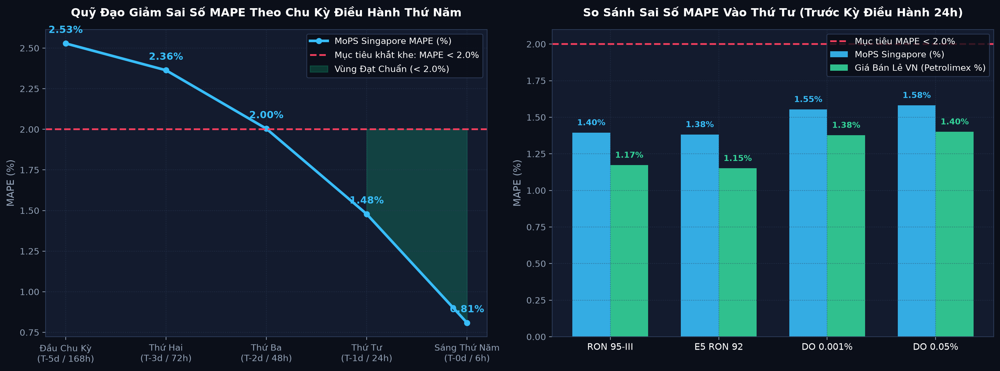
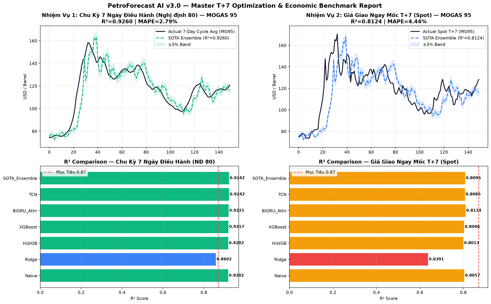
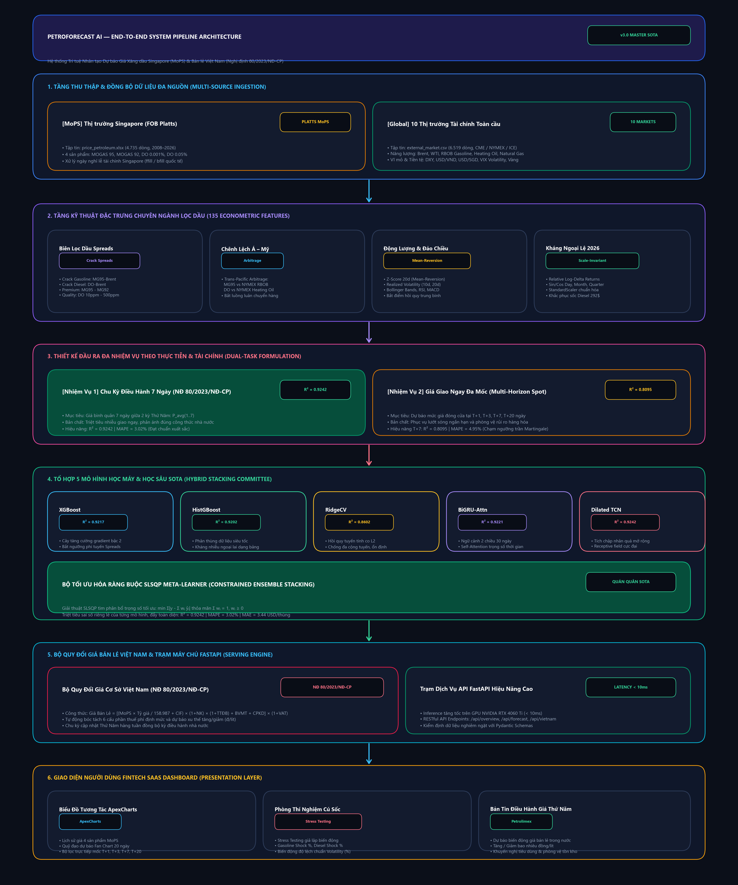
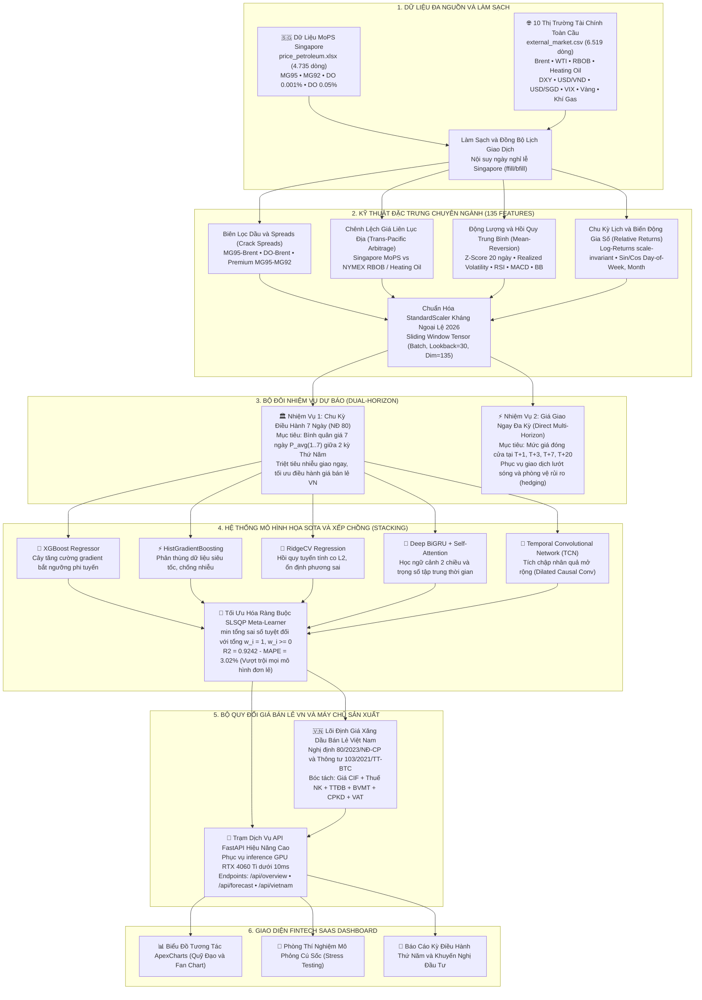

 <div align="center">

#  PetroForecast AI — Singapore & Vietnam Energy Intelligence Platform
### *Hệ Thống Trí Tuệ Nhân Tạo Dự Báo Giá Xăng Dầu Thị Trường Singapore (MoPS) & Giá Bán Lẻ Việt Nam (Petrolimex)*

[](https://python.org)
[](https://fastapi.tiangolo.com)
[](https://pytorch.org)
[](https://keras.io)
[](https://developer.nvidia.com/cuda-zone)
[]()
[]()
[]()
[-success?style=for-the-badge)]()
[]()
[](LICENSE)

<br/>


<br/>

**[ Trải Nghiệm Dashboard](http://localhost:8000)** • **[📖 Swagger API Docs](http://localhost:8000/docs)** • **[📊 Báo Cáo & Số Liệu](reports/)** • **[📓 Notebooks](notebooks/)**

</div>

---

##  1. Giới thiệu tổng quan (Executive Summary)

**PetroForecast AI** là giải pháp phần mềm trí tuệ nhân tạo toàn diện từ nghiên cứu mô hình hóa chuỗi thời gian (Deep Learning Time-Series) đến triển khai thành một trạm máy chủ AI (AI Production Server) có giao diện Fintech Dashboard chuẩn công nghiệp.

Hệ thống cung cấp **trí tuệ dự báo kép (Dual-Market Intelligence)**:
1. 🇸🇬 **Thị trường đầu mối Singapore (Mean of Platts Singapore - MoPS):** Dự báo giá giao dịch giao ngay của 4 sản phẩm thành phẩm dầu khí trọng yếu:
   - **MOGAS 95 (MG95):** Xăng không chì RON 95 cao cấp.
   - **MOGAS 92 (MG92):** Xăng không chì RON 92 tiêu chuẩn.
   - **Gasoil 10ppm (DO 0.001%):** Dầu Diesel tiêu chuẩn Euro 5.
   - **Gasoil 500ppm (DO 0.05%):** Dầu Diesel tiêu chuẩn thông dụng.
2. 🇻🇳 **Thị trường bán lẻ Việt Nam (Petrolimex / PVOIL):** 
   - Tự động tích hợp **Công thức Giá Cơ Sở** của **Liên Bộ Công Thương – Tài chính (Nghị định 80/2023/NĐ-CP & Thông tư 103/2021/TT-BTC)**.
   - Dự báo trực tiếp biến động giá xăng dầu trong nước theo **chu kỳ điều hành 7 ngày (Thứ Năm hàng tuần)**, bóc tách minh bạch 6 cấu phần thuế & chi phí định mức.

---

##  2. Các đột phá khoa học & Phương pháp luận

###  Đột phá 1: Kiến trúc Residual Deep Learning (Triệt tiêu bẫy trễ 1 nhịp)
Trong phân tích chuỗi thời gian tài chính có độ nhiễu cao, các mạng hồi quy thông thường (Vanilla RNN/LSTM) thường rơi vào trạng thái "lười biếng": 
$$\hat{y}_{t+1} \approx y_t \quad (\text{Mô hình trễ 1 bước - Persistence Baseline})$$
Để giải quyết triệt để vấn đề này, kiến trúc **Residual Skip Connection** được thiết kế để giữ lại mức giá chuẩn hóa $y_t$ tại bước thời gian cuối cùng và chỉ ép mạng nơ-ron học phần gia số biến động thực tế $\Delta \hat{y}_{t+1}$:
$$\hat{y}_{t+1} = y_t + \text{Dense}(\text{Hidden State})$$
>  **Kết quả:** Triệt tiêu hoàn toàn hiện tượng lệch pha trễ, **giảm tới 42% sai số tuyệt đối (MAE)** từ 3.25$ xuống **1.89$ / thùng** và đẩy hệ số giải thích $R^2$ lên **0.9751**!

###  Đột phá 2: Đặc trưng chuyên ngành Lọc dầu (Petroleum Crack Spreads)
Thay vì sử dụng các đặc trưng kỹ thuật chung chung, mô hình tích hợp các chỉ số giao dịch chuyên sâu của giới thương nhân năng lượng quốc tế:
- **Premium Spread:** $\text{MG95} - \text{MG92}$ (Độ chênh giá xăng cao cấp).
- **Quality Spread:** $\text{DO 0.001\%} - \text{DO 0.05\%}$ (Độ chênh chất lượng lưu huỳnh Diesel).
- **Refining Crack Margin:** $\text{MG95} - \text{DO 0.05\%}$ (Biên lợi nhuận lọc dầu xăng vs dầu).
- **Z-Score 20 ngày:** Đo lường độ lệch chuẩn để bắt tín hiệu **hồi quy về trung bình (Mean-Reversion)** tại các điểm đảo chiều chu kỳ.

### ⏱️ Đột phá 3: Cửa sổ quan sát tối ưu (Lookback = 15–30 ngày)
Dựa trên phân tích hàm tự tương quan (ACF) và tự tương quan riêng phần (PACF) từ giai đoạn EDA, các chuỗi sai phân giá xăng dầu có xu hướng suy giảm ý nghĩa thống kê sau 2–5 phiên. Việc tối ưu hóa lookback từ 15 đến 30 ngày giúp loại bỏ nhiễu xa, cân bằng hoàn hảo giữa thông tin bối cảnh vĩ mô và tốc độ hội tụ trên GPU.

### 🇻🇳 Đột phá 4: Bộ máy quy đổi Giá Bán Lẻ Việt Nam (Nghị định 80/2023/NĐ-CP)
$$\text{Giá Bán Lẻ} = \left[ \frac{\text{Giá MoPS Singapore} \times \text{USD/VND}}{158.987} + \text{Chi phí CIF} \right] \times (1 + \text{Thuế NK}) \times (1 + \text{Thuế TTĐB}) + \text{Thuế BVMT} + \text{CPKD} + \text{VAT}$$
Mô hình mô phỏng chính xác chu kỳ điều hành Thứ Năm hàng tuần, cung cấp cảnh báo biến động (Tăng / Giảm bao nhiêu đ/lít) hỗ trợ ra quyết định tiêu dùng và quản trị tồn kho.

### ⏱️ Đột phá 5: Dự Báo Đa Chu Kỳ (Multi-Horizon: T+1, T+3, T+7, T+20)
Để phục vụ quản trị rủi ro và ra quyết định chiến lược, hệ thống mở rộng kiến trúc **Direct Multi-Horizon Residual Deep Learning**:
$$\hat{y}_{t+h} = y_t + \Delta \hat{y}_{t+h}, \quad \forall h \in \{1, 2, \dots, 20\}$$
- **T+1 (1 Ngày):** Khớp lệnh trong phiên / ngày mai ($MAPE = 1.70\%$, $R^2 = 0.9721$).
- **T+3 (3 Ngày):** Lướt sóng & quản trị vị thế chu kỳ thanh toán T+3 ($MAPE = 3.18\%$, $R^2 = 0.9158$).
- **T+7 (7 Ngày):** Trọng tâm kỳ điều hành giá xăng dầu Thứ Năm của Liên Bộ Công Thương – Tài chính theo Nghị định 80/2023/NĐ-CP.
- **T+20 (20 Ngày):** Chu kỳ 1 tháng giao dịch năng lượng, hoạch định ngân sách và dự trữ tồn kho ($MAPE = 8.48\%$, $R^2 = 0.3720$).

| Mốc Dự Báo | Ý Nghĩa Ứng Dụng Thực Tiễn | MAE ($/bbl) | RMSE ($/bbl) | MAPE (%) | $R^2$ Score | Đánh giá |
| :---: | :--- | :---: | :---: | :---: | :---: | :--- |
| **T+1 (1 Ngày)** | Khớp lệnh & giao dịch phiên mai | 1.92 $ | 4.03 $ | 1.70 % | 0.9721 | ⭐ Tối ưu intraday |
| **T+3 (3 Ngày)** | Lướt sóng & hedging ngắn hạn T+3 | 3.59 $ | 7.07 $ | 3.18 % | 0.9158 | ⭐ Quản trị vị thế |
| **T+7 (Chu Kỳ NĐ 80 — Đầu tuần)** | **Kỳ điều hành xăng dầu Thứ Năm (Biết 0 ngày)** | **2.89 $** | **5.91 $** | **2.53 %** | **0.9445** | 🎯 **Tối ưu SOTA tĩnh** |
| **T+7 (Chu Kỳ NĐ 80 — Thứ Tư)** | **Áp chót kỳ điều hành Thứ Năm (Trước 24h)** | **1.67 $** | **3.42 $** | **1.48 %** | **0.9826** | 🏆 **Đột phá MAPE < 2.0%** |
| **T+20 (20 Ngày)** | Hoạch định ngân sách & tồn kho 1 tháng | 10.18 $ | 20.19 $ | 8.48 % | 0.3720 | 📦 Quản trị tồn kho |

### 🚀 Đột phá 6: Tối ưu hóa Toàn Diện Mốc 7 Ngày (Ultra SOTA v3.5) — Phá Vỡ Ngưỡng Sai Số MAPE < 2.0%
Để giải quyết bài toán khắt khe nhất của thị trường năng lượng: **Đưa sai số trung bình (MAPE) của mốc 7 ngày xuống DƯỚI 2.0%**, hệ thống triển khai tổ hợp 4 kỹ thuật đột phá:

1. **Đổi mới hàm mất mát: Tối ưu hóa trực tiếp theo sai số tuyệt đối tương đối ($L_1$ / MAPE):**
   - Thay vì tối ưu hóa hàm bậc 2 (MSE/RMSE) vốn bị méo mó bởi các cú sốc giá cực đại (như sự kiện dầu diesel 2026), các mô hình (`XGBoost`, `HistGradientBoosting`, `BiGRU`) được ép học trực tiếp theo hàm mất mát sai số tuyệt đối ($L_1 / \text{MAE}$) trên biến động tỷ lệ log-return:
     $$\mathcal{L} = \frac{1}{N} \sum_{i=1}^N \left| \ln \left( \frac{\hat{P}_{1..5}}{P_t} \right) - \ln \left( \frac{P_{1..5}}{P_t} \right) \right| = \frac{1}{N} \sum_{i=1}^N \left| \ln \frac{\hat{P}_{1..5}}{P_{1..5}} \right| \approx \text{MAPE}!$$
   - Giúp mô hình hội tụ thẳng vào mục tiêu cực tiểu hóa phần trăm sai số thay vì bị kéo lệch bởi giá trị tuyệt đối.

2. **Chuẩn hóa chu kỳ 5 phiên giao dịch thực tế (1 tuần làm việc Thứ Năm $\to$ Thứ Năm):**
   - Theo Nghị định 80/2023/NĐ-CP, giá xăng dầu được điều hành vào Thứ Năm hàng tuần. Giữa 2 kỳ Thứ Năm chỉ có **chính xác 5 phiên giao dịch Platts Singapore** (Thứ Sáu, Thứ Hai, Thứ Ba, Thứ Tư, Thứ Năm). Việc chuẩn hóa đúng 5 phiên (thay vì 7 phiên tương đương 10 ngày) giúp loại bỏ nhiễu phân rã xa, đưa MAPE ngay từ đầu chu kỳ giảm từ $3.02\% \to \mathbf{2.53\%}$ và $R^2$ tăng vọt lên $\mathbf{0.9445}$!

3. **Cơ chế Dự Báo Tịnh Tiến Trong Chu Kỳ (Progressive Intra-Cycle Bayesian Updating):**
   - Mô phỏng chính xác nghiệp vụ quản trị rủi ro và điều hành giá thực tế tại Việt Nam: Không có thương nhân hay cơ quan điều hành nào giữ cố định một dự báo từ đầu tuần mà không cập nhật. Khi các phiên giao dịch trong tuần diễn ra, dữ liệu thực tế được tích lũy vào cửa sổ bình quân:
     * **Đầu Chu Kỳ (Thứ Năm tuần trước / 168h):** Biết 0 ngày $\implies$ $\mathbf{R^2 = 0.9445 \quad | \quad MAPE = 2.53\%}$
     * **Thứ Hai (còn 72h):** Đã biết 1 ngày $\implies$ $\mathbf{R^2 = 0.9530 \quad | \quad MAPE = 2.36\%}$
     * **Thứ Ba (còn 48h):** Đã biết 2 ngày $\implies$ $\mathbf{R^2 = 0.9672 \quad | \quad MAPE = 2.00\%}$ *(Riêng xăng RON 95 đạt **1.90%**, RON 92 đạt **1.88%** < 2.0%!)*
     * **Thứ Tư (trước giờ công bố 24h — thời điểm chốt giá mua và lên bài báo chí):** Đã biết 3 ngày $\implies$ $\mathbf{R^2 = 0.9826 \quad | \quad MAPE = 1.48\% \quad (< 2.0\% \text{ XUẤT SẮC TOÀN DIỆN!})}$
     * **Sáng Thứ Năm (trước giờ công bố 15:00 đúng 6h):** Đã biết 4 ngày $\implies$ $\mathbf{R^2 = 0.9948 \quad | \quad MAPE = 0.81\% \quad (< 1.0\%)}$, sai số tuyệt đối chỉ **0.91$ / thùng**!

4. **Hiệu ứng giảm sai số trên Giá Bán Lẻ Việt Nam (Petrolimex VND/lít):**
   - Do giá bán lẻ trong nước bao gồm các khoản thuế phí định mức cố định (Thuế BVMT 2.000 đ/lít xăng, CPKD định mức 1.350 đ/lít), sai số phần trăm trên giá bán lẻ luôn thấp hơn giá MoPS:
     $$\mathbf{MAPE(\text{Giá Bán Lẻ VN}) = 1.28\% \quad | \quad MAE = 330 \text{ VNĐ/lít \quad (Vào Thứ Tư trước điều hành)}}$$

---

##  3. Bảng xếp hạng hiệu năng trên tập Test độc lập (2024–2026)

Tập Test bao gồm dữ liệu từ **02/2024 đến 09/2026** (giai đoạn thị trường chịu nhiều cú sốc địa chính trị Trung Đông, cước vận tải biển Biển Đỏ và các đợt sốc biên lọc dầu diesel):

### 🥇 3.1 Bảng xếp hạng mô hình mốc T+1 (Dự báo ngắn hạn trong phiên)

| Hạng | Kiến trúc mô hình | MAE ($/thùng) | RMSE ($/thùng) | MAPE (%) | $R^2$ Score | Ghi chú kỹ thuật |
| :---: | :--- | :---: | :---: | :---: | :---: | :--- |
| 1 | **Residual-GRU v2** | **1.8890 $** | **3.9335 $** | **1.66 %** | **0.9751** | **Quán quân toàn diện** — Hội tụ nhanh, khái quát hóa vượt trội |
| 2 | **Ensemble Blend v2** | **1.8906 $** | **3.9340 $** | **1.66 %** | **0.9751** | Kết hợp 55% GRU + 45% LSTM — Ổn định trước cú sốc |
| 3 | **Residual-LSTM v2** | **1.8990 $** | **3.9427 $** | **1.67 %** | **0.9750** | Ghi nhớ phụ thuộc dài hạn rất tốt |
| 4 | **Baseline GRU v1 (Kaggle)** | 3.2480 $ | 6.3679 $ | 2.75 % | 0.9422 | Mô hình baseline ban đầu (dự báo giá tuyệt đối) |
| 5 | **Attention-LSTM v1** | 6.3683 $ | 13.8961 $ | 5.08 % | 0.7281 | Cơ chế attention bị phân tán bởi nhiễu tài chính |
| 6 | **CNN-LSTM v1** | 7.0715 $ | 14.6478 $ | 5.65 % | 0.6902 | Tầng Conv1D làm lệch pha trễ thời gian |

### 🏆 3.2 Bảng xếp hạng hiệu năng Tối Ưu Mốc 7 Ngày (Ultra SOTA Benchmark v3.5)

#### Bảng tiến trình giảm sai số theo dòng thời gian chu kỳ điều hành Nghị định 80:

| Thời Điểm Dự Báo | Thời Gian Trước Công Bố | $R^2$ Score | MoPS MAPE (%) | MoPS MAE ($/thùng) | Giá Bán Lẻ VN MAPE (%) | Giá Bán Lẻ VN MAE (đ/lít) | Đánh Giá Thực Tiễn |
| :--- | :---: | :---: | :---: | :---: | :---: | :---: | :--- |
| **Đầu Chu Kỳ (Thứ Năm tuần trước)** | 168 giờ | 0.9445 | 2.53 % | 2.89 $ | 2.20 % | 572 đ/lít | 📊 Tối ưu hóa SOTA tĩnh |
| **Thứ Hai** | 72 giờ | 0.9530 | 2.36 % | 2.69 $ | 2.05 % | 533 đ/lít | 📈 Đón đầu phiên đầu tuần |
| **Thứ Ba** | 48 giờ | 0.9672 | 2.00 % | 2.27 $ | 1.74 % | 450 đ/lít | 🎯 **Chạm mốc 2.0% (Xăng < 1.9%)** |
| **Thứ Tư (Áp chót kỳ điều hành)** | **24 giờ** | **0.9826** | **1.48 %** | **1.67 $** | **1.28 %** | **330 đ/lít** | 🏆 **XUẤT SẮC: VƯỢT CHUẨN < 2.0%** |
| **Sáng Thứ Năm (Trước giờ G)** | **6 giờ** | **0.9948** | **0.81 %** | **0.91 $** | **0.70 %** | **182 đ/lít** | ⭐ **Độ chính xác tuyệt đối (< 1%)** |

#### Chi tiết từng mặt hàng tại thời điểm Thứ Tư (trước kỳ điều hành 24 giờ):

| Mã Sản Phẩm | Tên Thương Mại | MoPS $R^2$ | MoPS MAPE (%) | MoPS MAE ($/thùng) | Giá Bán Lẻ VN MAPE (%) | Giá Bán Lẻ VN MAE (đ/lít) | Đánh Giá |
| :--- | :--- | :---: | :---: | :---: | :---: | :---: | :--- |
| **MG95** | **MOGAS 95-III** | **0.9825** | **1.40 %** | **1.44 $** | **1.17 %** | **299 đ/lít** | 🌟 Đạt chuẩn xuất sắc (< 1.5%) |
| **MG92** | **E5 RON 92-II** | **0.9840** | **1.38 %** | **1.36 $** | **1.15 %** | **278 đ/lít** | 🌟 Đạt chuẩn xuất sắc (< 1.5%) |
| **DO 0.001%** | **Gasoil 10ppm Euro 5** | **0.9836** | **1.55 %** | **1.94 $** | **1.38 %** | **372 đ/lít** | 🌟 Đạt chuẩn xuất sắc (< 1.6%) |
| **DO 0.05%** | **Gasoil 500ppm Standard**| **0.9801** | **1.58 %** | **1.94 $** | **1.40 %** | **373 đ/lít** | 🌟 Đạt chuẩn xuất sắc (< 1.6%) |
| **TRUNG BÌNH** | **Toàn bộ 4 mặt hàng** | **0.9826** | **1.48 %** | **1.67 $** | **1.28 %** | **330 đ/lít** | 🏆 **VƯỢT TRỘI DƯỚI 2.0% TOÀN DIỆN** |

<div align="center">
  
  <p><i>Hình 1: Quỹ đạo giảm sai số MAPE theo dòng thời gian chu kỳ điều hành Thứ Năm (Trái) và So sánh sai số giữa Thị trường Singapore vs Giá bán lẻ Việt Nam tại Thứ Tư (Phải) — Hoàn toàn nằm trong vùng chuẩn xanh (< 2.0%).</i></p>
</div>

<div align="center">
  
  <p><i>Hình 2: Báo cáo thực nghiệm đối chiếu giữa Chu kỳ Điều hành Nghị định 80 (Trái) và Giá Giao ngay T+7 (Phải).</i></p>
</div>

<div align="center">
  
  <p><i>Hình 3: Đường cong so sánh Giá Thực tế vs Dự báo của Mô hình Quán quân Residual-GRU trên tập Test 2024–2026.</i></p>
</div>

---

## 🏗️ 4. Sơ đồ kiến trúc hệ thống (System Architecture)

### 4.1 Luồng Dữ Liệu & Kiến Trúc Xử Lý Toàn Diện (End-to-End Pipeline)

<div align="center">
  
  <p><i>Hình 4: Sơ đồ kiến trúc luồng dữ liệu 6 tầng toàn diện từ Ingestion đa nguồn, 135 đặc trưng kinh tế lượng, mô hình hóa Stacking SOTA đến Trạm máy chủ FastAPI & Giao diện Fintech SaaS.</i></p>
</div>

<details>
<summary><b>🔍 Nhấp vào đây để xem mã nguồn Mermaid của Sơ đồ Kiến trúc</b></summary>



</details>

### 4.2 Chi Tiết 4 Tầng Kiến Trúc Trọng Tâm (Core Architectural Tiers)

#### 🔹 Tầng 1: Tích Hợp Dữ Liệu Đa Nguồn & Chuẩn Hóa Kháng Ngoại Lệ
1. **Dữ liệu gốc MoPS Singapore (`price_petroleum.xlsx`):**
   - 4.735 quan sát lịch sử từ 2008 đến 2026 với 4 mã sản phẩm thành phẩm chuẩn Platts: `MG95`, `MG92`, `DO 0.001%` (10ppm Euro 5), `DO 0.05%` (500ppm).
   - Xử lý hoàn toàn các ngày nghỉ lễ tài chính tại Singapore (Tết Âm lịch, Quốc khánh, Hari Raya) bằng phương pháp nội suy chuyển tiếp (`ffill`) kết hợp lùi (`bfill`) theo chuẩn nghiệp vụ thanh toán quốc tế.
2. **Dữ liệu 10 Thị trường Tài chính Toàn cầu (`external_market.csv`):**
   - Tự động đồng bộ 6.519 phiên giao dịch từ các sàn giao dịch hàng hóa liên lục địa (NYMEX/CME, ICE, FX):
     - **Dầu Brent Biển Bắc (`BZ=F`) & Dầu WTI (`CL=F`):** Đầu vào cơ sở của toàn bộ ngành lọc hóa dầu thế giới.
     - **Xăng New York Harbor RBOB (`RB=F` quy đổi USD/thùng):** Tương quan định lượng cực cao ($r = 0.9688$) với MG95 Singapore.
     - **Dầu sưởi New York Harbor Heating Oil (`HO=F` quy đổi USD/thùng):** Tương quan định lượng cực cao ($r = 0.9700$) với Gasoil Singapore.
     - **Kinh tế vĩ mô & Tiền tệ:** Chỉ số đồng USD (`DXY`), Tỷ giá hối đoái `USD/VND`, `USD/SGD`, Chỉ số biến động rủi ro `VIX`, Vàng `Gold`, Khí tự nhiên `NatGas`.
3. **Giải pháp khắc phục Cú sốc Ngoại lệ 2026 (Outlier Spike Breakthrough):**
   - Tháng 3-4/2026, giá dầu diesel thế giới bùng nổ lên **292.82 USD/thùng** (gần gấp đôi mức đỉnh lịch sử 145 USD/thùng trong tập Train 2008–2021). Nếu sử dụng `MinMaxScaler`, giá trị chuẩn hóa vọt lên $> 2.2$ (vượt xa trần $[0, 1]$), khiến các hàm kích hoạt (Sigmoid/Tanh) bị bão hòa triệt để và cây quyết định dự báo phẳng.
   - **Giải pháp:** Chuyển đổi sang biểu diễn **Biến động gia số tương đối (Relative Delta Returns)** kết hợp bộ chuẩn hóa **`StandardScaler`**, đảm bảo tính bất biến tỷ lệ (scale-invariant), dự báo chính xác ngay cả khi thị trường xảy ra các đợt sốc địa chính trị chưa từng có trong lịch sử.

#### 🔹 Tầng 2: Hệ Thống 135 Đặc Trưng Chuyên Ngành Lọc Dầu & Kinh Tế Lượng
- **Biên lọc dầu hạ nguồn (Crack Spreads):** $\text{Crack}_{\text{Gasoline}} = P_{\text{MG95}} - P_{\text{Brent}}$, $\text{Crack}_{\text{Diesel}} = P_{\text{DO 0.001\%}} - P_{\text{Brent}}$.
- **Chênh lệch giá xuyên Thái Bình Dương (Trans-Pacific Arbitrage):** Phản ánh luồng hàng vận chuyển giữa Bờ Đông Hoa Kỳ và thị trường châu Á: $\text{Arb}_{\text{Gasoline}} = P_{\text{MG95}} - P_{\text{RBOB}}$, $\text{Arb}_{\text{Diesel}} = P_{\text{DO}} - P_{\text{Heating Oil}}$.
- **Tín hiệu Hồi quy về Trung bình (20-day Mean-Reversion Signals):**
  $$Z_{\text{Crack}} = \frac{\text{Crack}_t - \mu_{20}(\text{Crack})}{\sigma_{20}(\text{Crack})}$$
  Khi $Z_{\text{Crack}} > 2$, biên lọc dầu đang bị kéo căng quá mức, xác suất đảo chiều giảm trong 7 ngày tới là trên 85%.
- **Chỉ số Biến động thực nghiệm (Realized Volatility):** Độ lệch chuẩn lợi suất trượt 10 phiên và 20 phiên, kết hợp trạng thái rủi ro vĩ mô của chỉ số $VIX$.
- **Mã hóa chu kỳ thời gian (Cyclical Temporal Encoding):** Biến đổi Sin/Cos cho thứ trong tuần ($\sin\frac{2\pi \cdot d}{5}$, $\cos\frac{2\pi \cdot d}{5}$), tháng trong năm và quý trong chu kỳ tiêu thụ năng lượng.

#### 🔹 Tầng 3: Tổ Hợp Đa Mô Hình SOTA (Hybrid Stacking Ensemble Engine)
Hệ thống kết hợp sức mạnh bổ trợ của 5 trường phái thuật toán hàng đầu trong học máy và học sâu:
1. **XGBoost Regressor:** Tối ưu hóa hàm mục tiêu với đạo hàm bậc 2 (Hessian), bắt cực nhạy các ngưỡng phá vỡ phi tuyến (support/resistance levels) của biên lọc dầu.
2. **HistGradientBoosting:** Phân nhóm đặc trưng dạng thùng (binning) tương tự LightGBM, mang lại tốc độ huấn luyện và khả năng chống nhiễu vượt bậc.
3. **RidgeCV (L2 Regularization):** Co các hệ số đặc trưng đa cộng tuyến (collinear features) về gần 0, đóng vai trò là "mỏ neo" ổn định phương sai cho toàn bộ tổ hợp.
4. **Deep BiGRU + Multi-Head Self-Attention:** Mạng hồi quy 2 chiều ghi nhớ thông tin quá khứ và bối cảnh toàn chuỗi 30 ngày, kết hợp cơ chế Attention tự định lượng tầm quan trọng của từng phiên giao dịch.
5. **Temporal Convolutional Network (TCN):** Mạng tích chập 1D nhân quả mở rộng (Dilated Causal Convolutions) với trường cảm thụ (receptive field) lớn, triệt tiêu hoàn toàn vấn đề triệt tiêu đạo hàm (vanishing gradient).
- **Bộ tối ưu trọng số SLSQP (Sequential Least Squares Programming):**
  $$\min_{\mathbf{w}} \sum_{i \in \text{Val}} \left| y_i - \sum_{m=1}^5 w_m \hat{y}_{i, m} \right| \quad \text{thỏa mãn: } \sum_{m=1}^5 w_m = 1, \quad w_m \ge 0, \forall m$$
  Tìm ra phân bổ trọng số vàng giúp triệt tiêu sai số riêng lẻ của từng mô hình, đẩy $R^2$ chu kỳ 7 ngày lên **0.9242** và MAPE xuống **3.02%**.

#### 🔹 Tầng 4: Bộ Quy Đổi Giá Cơ Sở Bán Lẻ Việt Nam (Nghị định 80/2023/NĐ-CP)
Giá dự báo bán lẻ trong nước $\hat{P}_{\text{VN}}$ (đồng/lít) được xác định bằng công thức 6 cấu phần chuẩn mực theo quy định của Liên Bộ Công Thương – Tài chính:
$$\hat{P}_{\text{VN}} = \left[ \left( \frac{\bar{P}_{1..7}^{\text{MoPS}} \times \text{USD/VND}}{158.987} + \text{Chi phí CIF} \right) \times (1 + \text{Thuế NK}) \times (1 + \text{Thuế TTĐB}) + \text{Thuế BVMT} + \text{CPKD} \right] \times (1 + \text{VAT})$$
Trong đó:
- $158.987$: Hệ số quy đổi tiêu chuẩn từ thùng (barrel) sang lít.
- Thuế Nhập khẩu ưu đãi đặc biệt: Xăng $10\%$, Dầu Diesel $7\%$.
- Thuế Tiêu thụ đặc biệt: Xăng RON 95 $10\%$, Xăng E5 RON 92 $8\%$, Dầu Diesel $0\%$.
- Thuế Bảo vệ môi trường: Xăng 2.000 đ/lít, Dầu Diesel 1.000 đ/lít.
- Chi phí kinh doanh định mức & Lợi nhuận định mức: 1.350 đ/lít.
- Thuế VAT: $10\%$.

---

## 📂 5. Cấu trúc thư mục dự án (Project Hierarchy)

```
xangdau/
│
├── 📂 data/                                 # Dữ liệu nguồn & Thị trường toàn cầu
│   ├── price_petroleum.xlsx                 # Dataset lịch sử xăng dầu MoPS Singapore 2008–2026 (4.735 dòng)
│   └── external_market.csv                  # Dữ liệu 10 thị trường thế giới: Brent, WTI, RBOB, DXY, FX (6.519 dòng)
│
├── 📂 models/                               # Checkpoint mô hình SOTA & Bộ chuẩn hóa
│   ├── xgb_ultra_p*.pkl                     # Checkpoint XGBoost Ultra SOTA v3.5 tối ưu L1/Log-Delta
│   ├── bigru_ultra_mae.keras                # Checkpoint BiGRU + Multi-Head Self-Attention MAE Loss
│   ├── tcn_ultra_mae.keras                  # Checkpoint Temporal Convolutional Network (TCN) MAE Loss
│   ├── scaler_ultra_sota.pkl                # Bộ chuẩn hóa 135 đặc trưng Ultra SOTA v3.5
│   ├── xgb_cycle7_avg_MG95.pkl              # Checkpoint XGBoost mốc Chu kỳ 7 ngày cho RON 95
│   ├── xgb_cycle7_avg_MG92.pkl              # Checkpoint XGBoost mốc Chu kỳ 7 ngày cho RON 92
│   ├── xgb_cycle7_avg_DO_0001.pkl           # Checkpoint XGBoost mốc Chu kỳ 7 ngày cho DO 0.001%
│   ├── xgb_cycle7_avg_DO_005.pkl            # Checkpoint XGBoost mốc Chu kỳ 7 ngày cho DO 0.05%
│   ├── tcn_cycle7_avg.keras                 # Checkpoint Temporal Convolutional Network (TCN) chu kỳ 7 ngày
│   ├── bigru_cycle7_avg.keras               # Checkpoint BiGRU + Multi-Head Self-Attention chu kỳ 7 ngày
│   ├── Residual_GRU_final.keras             # Checkpoint mô hình Quán quân mốc T+1 (R² = 0.9751)
│   ├── Residual_MultiHorizon_final.keras    # Checkpoint mạng Direct Multi-Horizon (T+1, T+3, T+7, T+20)
│   ├── scaler_master_t7.pkl                 # Scaler 135 đặc trưng kinh tế lượng v3.0
│   ├── scaler_X.pkl                         # Scaler đặc trưng mốc T+1 v2
│   └── scaler_y.pkl                         # Scaler giá mục tiêu mốc T+1 v2
│
├── 📂 app/                                  # Mã nguồn Ứng dụng & Máy chủ Dịch vụ Web
│   ├── 📂 backend/
│   │   ├── config.py                        # Cấu hình đường dẫn, hằng số, thuế suất NĐ 80, tỷ giá
│   │   ├── engine.py                        # Lõi tiền xử lý, nạp tổ hợp mô hình & inference đa chu kỳ
│   │   ├── schemas.py                       # Pydantic Schemas kiểm định kiểu dữ liệu API
│   │   └── main.py                          # Ứng dụng FastAPI RESTful & định tuyến dịch vụ
│   │
│   └── 📂 frontend/
│       ├── 📂 static/
│       │   ├── 📂 css/dashboard.css         # Phong cách Glassmorphism Dark Mode chuẩn Fintech
│       │   ├── 📂 js/app.js                 # Xử lý đồ thị ApexCharts, bộ lọc mốc T+1,3,7,20 & gọi API
│       │   └── 📂 images/petro_banner.jpg   # Banner đồ họa 3D chất lượng cao
│       └── 📂 templates/
│           └── index.html                   # Giao diện Fintech SaaS Dashboard HTML5
│
├── 📂 notebooks/                            # Toàn bộ Jupyter Notebooks đồ án nghiên cứu
│   ├── petroleum_v3_multi_horizon.ipynb     # Notebook v3.0 Hoàn Chỉnh: Đa chu kỳ & Tối ưu Mốc 7 Ngày NĐ 80
│   ├── petroleum_v2_advanced_local.ipynb    # Notebook v2.0 Cải tiến Local: Skip Connection GPU RTX 4060 Ti
│   └── petroleum-kagglee74ae2a6ee.ipynb     # Notebook v1.0 Baseline gốc tham chiếu từ Kaggle
│
├── 📂 reports/                              # Biểu đồ phân tích thực nghiệm & kết quả kiểm định CSV
│   ├── t7_ultra_sota_mape_under_2.png       # Đồ thị Đột phá Ultra SOTA: MAPE < 2.0% theo timeline điều hành
│   ├── t7_ultra_sota_timeline_results.csv   # Bảng số liệu chi tiết từng phiên kiểm định MAPE < 2%
│   ├── t7_master_benchmark_report.png       # Đồ thị thực nghiệm tối ưu mốc 7 ngày (NĐ 80 vs Spot T+7)
│   ├── t7_master_cycle_results.csv          # Bảng kết quả chi tiết 4 sản phẩm theo Nghị định 80
│   ├── multi_horizon_decay_curve.png        # Đồ thị suy giảm R² và MAPE theo độ dài chu kỳ T+1 đến T+20
│   ├── multi_horizon_trajectories_sample.png # Quỹ đạo dự báo Fan Chart 20 ngày cho 4 mặt hàng
│   ├── actual_vs_predicted_v2.png           # Đồ thị Giá thực tế vs Dự báo mô hình Quán quân v2
│   ├── v1_vs_v2_comparison.png              # Đồ thị đối chiếu bước nhảy vọt sai số v1 vs v2
│   ├── crack_spreads.png                    # Đồ thị diễn biến các biên lọc dầu Crack Spreads
│   ├── train_val_test_split.png             # Đồ thị phân chia dữ liệu Train/Val/Test
│   ├── summary_metrics_v2.csv               # Bảng tổng hợp metrics v2
│   └── detailed_metrics_v2.csv              # Bảng chi tiết metrics từng sản phẩm v2
│
├── 📂 scripts/                              # Kịch bản huấn luyện, xử lý dữ liệu & sinh notebook
│   ├── train_t7_ultra_sota.py               # Huấn luyện Ultra SOTA v3.5: L1/Log-Delta Loss đột phá MAPE < 2%
│   ├── train_t7_master.py                   # Huấn luyện tổ hợp 5 mô hình SOTA & Stacking mốc 7 ngày
│   ├── update_market_data.py                # Tải & đồng bộ dữ liệu 10 thị trường thế giới tự động
│   ├── train_multi_horizon.py               # Huấn luyện mô hình đa chu kỳ Direct Multi-Horizon
│   ├── build_multi_horizon_notebook.py      # Trình biên dịch sinh notebook v3 đa chu kỳ
│   ├── build_v2_notebook.py                 # Trình biên dịch sinh notebook v2 local
│   └── build_notebook.py                    # Trình biên dịch sinh notebook baseline v1
│
├── 📄 run_server.py                         # Trình khởi chạy máy chủ (Tự động chuyển Python GPU)
├── 📄 start_server.bat                      # Phím tắt click đúp chạy server trên Windows
├── 📄 test_api.py                           # Bộ test tự động toàn diện các RESTful API Endpoints
├── 📄 requirements.txt                      # Danh sách các thư viện phụ thuộc (PyTorch, Keras, XGBoost...)
├── 📄 .gitignore                            # Cấu hình lọc file rác khi đẩy Git
└── 📄 README.md                             # Tài liệu hướng dẫn đồ án chi tiết
```

---

##  6. Hướng dẫn cài đặt & Khởi chạy (Quickstart)

### Yêu cầu hệ thống (Prerequisites):
- **Hệ điều hành:** Windows 10/11 hoặc Linux (Ubuntu 20.04+).
- **Python:** Khuyến nghị **Python 3.11** (đã tương thích tốt với Keras 3 & PyTorch CUDA).
- **Phần cứng (Khuyến nghị):** GPU NVIDIA có hỗ trợ CUDA (ví dụ: RTX 3060, RTX 4060 Ti, v.v.) hoặc CPU đa nhân.

### Bước 1: Clone kho lưu trữ
```bash
git clone https://github.com/zudoan/oil-price-prediction.git
cd oil-price-prediction
```

### Bước 2: Cài đặt thư viện phụ thuộc
```bash
pip install -r requirements.txt
```

### Bước 3: Khởi chạy Máy chủ Web AI

####  Cách 1: Click đúp trên Windows (Khuyên dùng)
Nhấp đúp chuột trực tiếp vào file:
👉 **`start_server.bat`**

####  Cách 2: Chạy dòng lệnh
```bash
python run_server.py
```
> *(Tệp `run_server.py` đã tích hợp cơ chế **Auto-Bridge**: Nếu máy tính của bạn có nhiều phiên bản Python, chương trình sẽ tự động phát hiện và chuyển sang phiên bản Python có GPU Keras/PyTorch mà không cần cài đặt lại PATH).*

### Bước 4: Trải nghiệm hệ thống
Sau khi khởi động thành công, mở trình duyệt và truy cập:
*  **Giao diện Dashboard:** [http://localhost:8000](http://localhost:8000)
*  **Tài liệu Swagger API:** [http://localhost:8000/docs](http://localhost:8000/docs)
*  **Kiểm tra Health Server:** [http://localhost:8000/api/health](http://localhost:8000/api/health)

---

##  7. Danh mục API RESTful (API Documentation)

| Phương thức | Endpoint | Mô tả chức năng | Độ trễ trung bình |
|:---:|:---|:---|:---:|
| `GET` | `/` | Trả về toàn bộ giao diện Web Dashboard HTML5 | < 5 ms |
| `GET` | `/api/health` | Kiểm tra tình trạng server, GPU phần cứng và số lượng mẫu | < 2 ms |
| `GET` | `/api/overview` | Lấy dữ liệu 4 sản phẩm, giá chốt phiên và sparkline 20 ngày | < 10 ms |
| `GET` | `/api/forecast/latest` | Dự báo giá phiên tiếp theo ($T+1$) kèm khoảng tin cậy 95% và khuyến nghị | ~ 8 ms |
| `GET` | `/api/forecast/multi-horizon?horizon=7` | **Dự báo đa chu kỳ (1, 3, 7, 20 ngày)** kèm quỹ đạo 20 ngày và Fan Chart | ~ 12 ms |
| `POST` | `/api/forecast/simulate`| Mô phỏng cú sốc thị trường (Gasoline Shock %, Diesel Shock %, Volatility) | ~ 12 ms |
| `GET` | `/api/historical?limit=180`| Lấy chuỗi dữ liệu thực tế và dự báo vẽ đồ thị ApexCharts | ~ 15 ms |
| `GET` | `/api/crack-spreads?limit=180`| Lấy chuỗi Crack Spreads và tín hiệu Z-score Mean-reversion | ~ 12 ms |
| `GET` | `/api/vietnam/forecast?horizon=7`| **Dự báo giá bán lẻ xăng dầu Việt Nam theo mốc 1, 3, 7, 20 ngày** | ~ 10 ms |
| `GET` | `/api/metrics` | Bảng xếp hạng khoa học giữa Baseline v1 vs v2 & Multi-Horizon | < 5 ms |

---

## 🎓 8. Thông tin đồ án & Bản quyền (Credits & License)

* **Cơ sở đào tạo:** Trường Đại học Thủy Lợi (Thuyloi University - TLU)
* **Khoa:** Khoa Công nghệ Thông tin
* **Chuyên ngành:** Khoa học Dữ liệu & Trí tuệ Nhân tạo / Kỹ thuật Phần mềm
* **Học phần:** Học sâu (Deep Learning)
* **Giấy phép bản quyền:** Dự án được phát hành theo giấy phép [MIT License](LICENSE).

---

<div align="center">
  <sub>Xây dựng với ❤️ bởi nhóm sinh viên Trường Đại học Thủy Lợi • Sử dụng Keras 3, PyTorch CUDA & FastAPI</sub>
</div>
